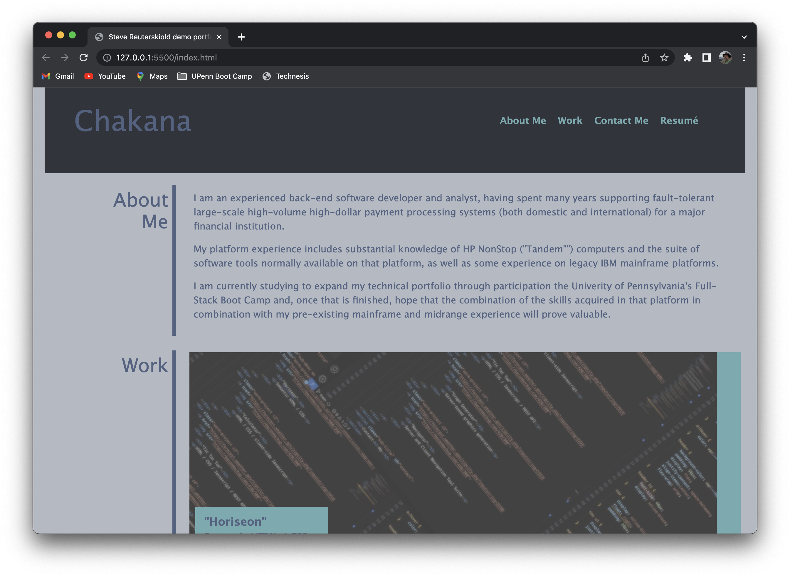

# CHAKANA demo page

## Description

A project whose goal is to create a gateway landing page for accessing various tools and sites I have created or will have created during
my time as a student in the University of Pennsylvania Full-Stack Boot Camp.  At present, not all links on the site create lead to
project sites, as most have not yet been developed, but that is, hopefully, subject to change in the coming weeks.

- In completing this project, the following have been learned:
    - Use of semantic elements in HTML
    - Use of element styles in CSS
        - grid
        - flexbox
        - media queries
        - etc.

## Table of Contents (Optional)

- [Usage](#usage)
- [Credits](#credits)
- [License](#license)

## Installation

For users of the this landing page, there is no installation needed beyond having a browser.  (see [Usage](#usage))

For developers, installation requires:
- Access to GitHub repository [github.com/stevreut/demoPortfolio](https://github.com/stevreut/demoPortfolio) 
- Appropriate tools for editing, testing, and deploying component modules.

## Usage

The resuts of this project are an enhanced version of the Horiseon web site which is used simply by accessing that site via web browser at [stevreut.github.io/demoPortfolio/](https://stevreut.github.io/demoPortfolio/) .

Resulting web presentation should resemble the following:

## Credits

Special thanks to the teaching staff of the University of Pennsylvania Full Stack Coding Boot Camp (UPENN-VIRT-FSF-FT-07-2023-U-LOLC-M-F).

Innumerable publicly available reference resources were consulted in pursuing this project.

## License

As of this date (25 July 2023), no licensing policy has been established for this project or its repository.
